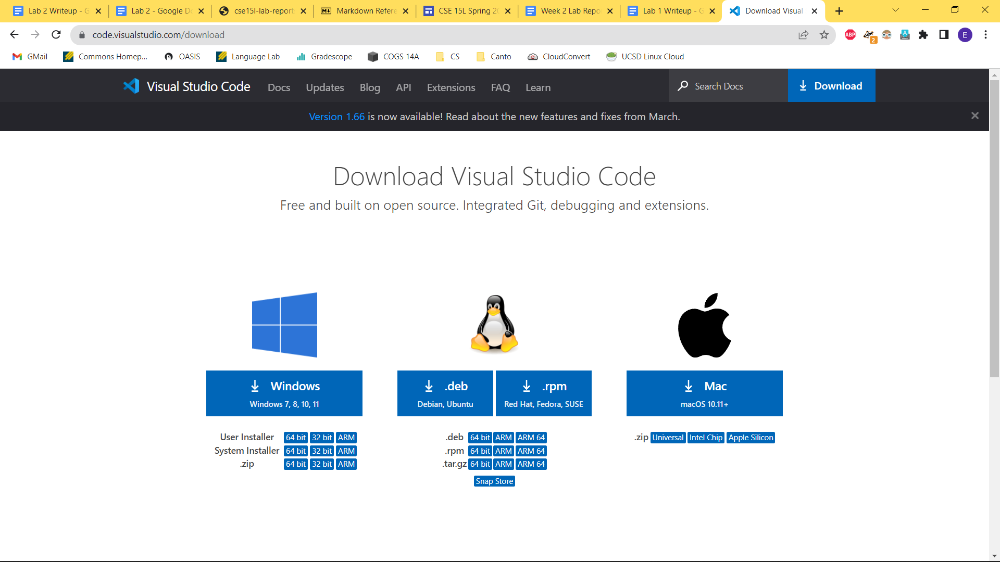
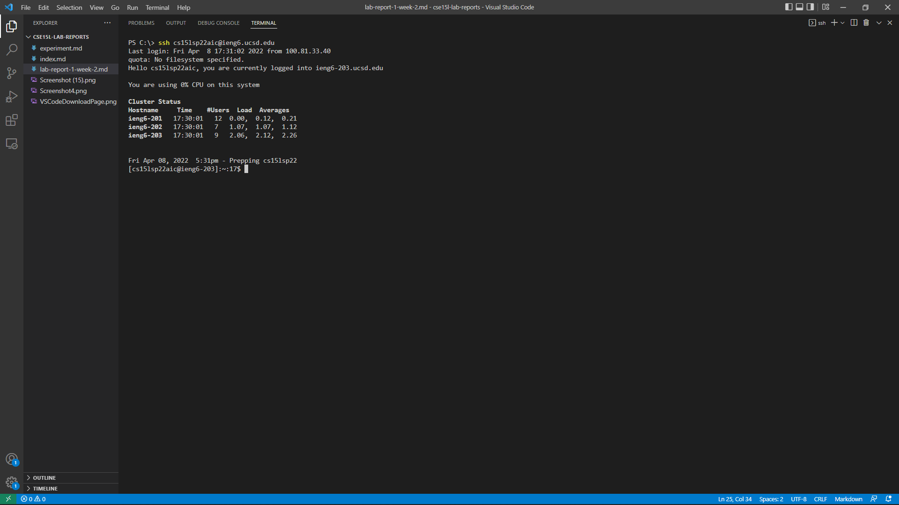
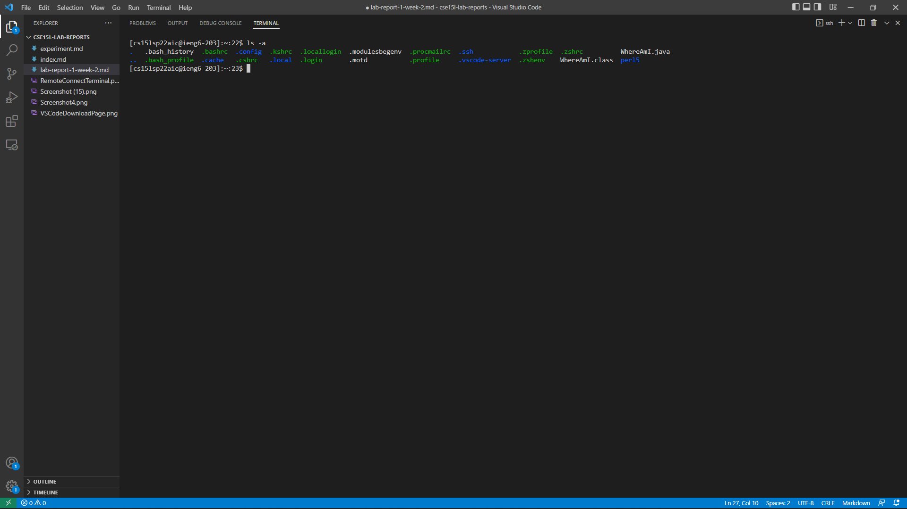

# Logging onto *ieng6*: 
## Installing VS Code:
First, you need to use Visual Studio Code (VS Code), where you can download from 
[here](https://code.visualstudio.com/download), as shown in the screenshot below.

## Remotely Connecting: 
Before you can remotely connect to your course-specific account, you will need to also download openSSH. [Here](https://docs.microsoft.com/en-us/windows-server/administration/openssh/openssh_install_firstuse) is a Microsoft page to guide the process.  
Once you are finished with this setup, you can start the remote connection process. Open the terminal on VS Code using `` Ctrl + ` ``. Inside of the terminal, type the command:
  
`ssh cs15lsp22XX@ieng6.ucsd.edu`
  
The email will be different based on the course, and the XX will be specific letters for your specific account. Do an account lookup on [https://sdacs.ucsd.edu/~icc/index.php](https://sdacs.ucsd.edu/~icc/index.php/). 
Once you type in your password, you will be successfully connected! 

## Trying Different Commands: 
There are many commands that will be used in the terminal. Here are some examples of useful commands and what they do:   
`ls` ------------ lists out the files and folders in the current directory 
`ls -a` -------- lists out everything, including hidden files 
`cd` ------------ change directory, follow it up with the file you want to go to 
`cd ..` -------- go back a directory 
`cp` ------------ copies a file or directory 
`scp` ----------- secure copy 
`cat` ----------- shows what is inside of the file, the contents of the file 
 

## Moving files with `scp`: 
After working on something on your local computer, you can move your files between computers. In order to move files from a local computer to a remote computer, the command `scp` is used. **Make sure to use it in the client terminal, so not while logged into the remote computer.**

.png) 

After this, you can use the `ls` command again inside of the remotely logged in terminal to check and see that the file was successfully moved over. 

.png) 

## Setting an SSH Key: 
In order to speed up the process of working remotely, we can set up an SSH Key. What is does it basically save your login information so that you can login in quickly without needing to enter a password. Use the command:
 
`ssh-keygen`  
When it asks for a passphrase, just press `Enter` twice in order to use an empty passphrase.  
If you are on Windows, do the command: 
`ssh-keygen -t ed25519` 
Continue with: 
`ssh cs15lsp22XX@ieng6.ucsd.edu` 
On the remotely logged in terminal (server): 
`mkdir .ssh` and then log out 
Go back to the local (client) terminal: 
`scp /Users/<user-name>/.ssh/id_rsa.pub cs15lsp22XX@ieng6.ucsd.edu:~/.ssh/authorized_keys` 
The path will differ based on where you stored the key creation file. 
After this, you should be able to log on without a password!
 
.png)

## Optimizing Remote Running: 
You can further optimize remote running by speeding up the process of dealing with the commands in the terminal. Some useful tips are that: 

- you can use the `Up Arrow` key to redo previous commands that were typed in
- use an `;` to seperate different commands while writing them in the same line
- putting a command in `" "` after using `ssh` to login will streamline the process of logging in, running the command, and then logging out into 1 line. 

For example, I was able to move and run a file with two lines, and four keystrokes:
.png)
.png)