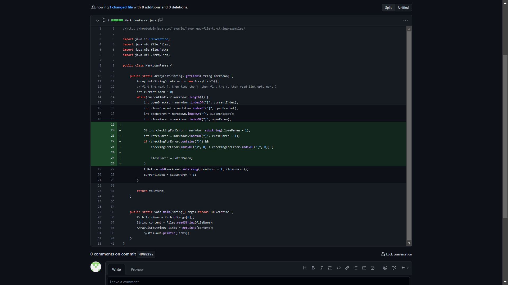
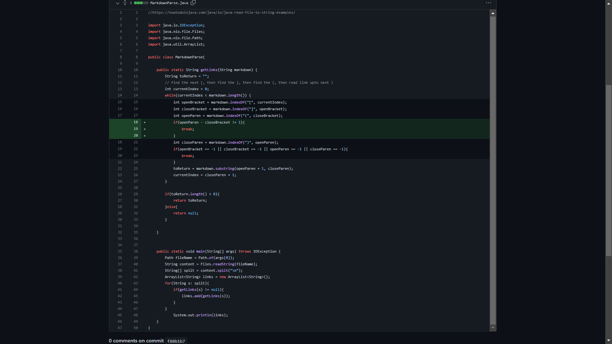
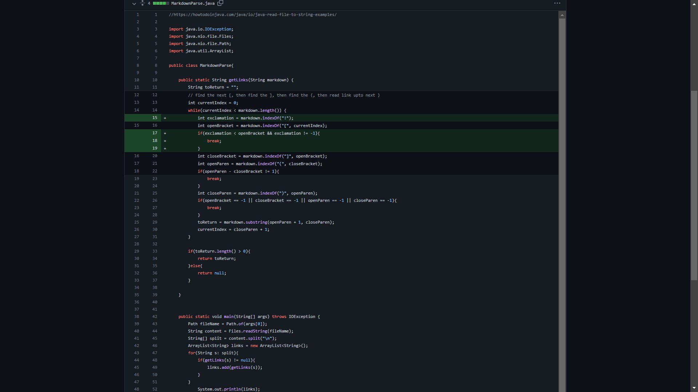

# First Code Change 

 
This first change was made because of the a failure-inducing input involving there being multiple parentheses within the links' body
([test file](https://github.com/encheng0706/markdown-parser-fork/blob/b6959ec2e3a5ad66e358b3f23a1d301fa6abc00f/new-tf.md?plain=1)).
When running this file through the parser, it resulted in the program returning  
> [https://s(, some-thing.html]  

when it should have returned 

> [https://s()mething.com, some-thing.html]  

In order to solve this, I tried to write a section of code that checked for a closing parenthesis. Once it found the first instance of it, the program would "bookmark" that index and look for another one until it reached a open bracket, which meant that it reached a new link. If it found a parenthesis, it would set the value of `closeParen` to the latest closed parenthesis, which ensured that the full link would be put as a string that would be returned. 

# Second Code Change 

 

This second code change built off of the orginal markdown-parser file, since it was done from my group. This change was made for an issue of an invalid link because of a space between the syntax for creating a link, such as the space causing an issue with link 2 in [this test file](https://github.com/encheng0706/markdown-parser-fork/commit/218392f8f9892d5ce6ea9481874d5fa1dd992342). Before the change, the second link would be included in the output, like  

> [https://something.com, doesntwork.com, some-thing.html]

when the correct output should have been 

> [https://something.com, some-thing.html]

The break statement is used so that if the difference between `closeBracket` and `openParen` is greater than 1, it would not be part of the string that would be returned. The check of being greater than 1 is to ensure that there would be no space between `](`, like `] (`, which invalidates the syntax for creating a link. 

# Third Code Change 

 

The third code change was for another issue of the parser confusing links with images, due to the only difference in syntax being an `!` in front, which is outside of the area that the original parser code checks for. For [this test file](https://github.com/encheng0706/markdown-parser-fork/blob/main/image-tf.md?plain=1), the original output resulted in the image also being included as link 

> [something.png, reallink.html]

when the correct input is 

> [reallink.html]

The program was changed in get the index of exclamation points and check if it was right before the `openBracket`. If it was then it would break and not add the image as part of the list of returned links.