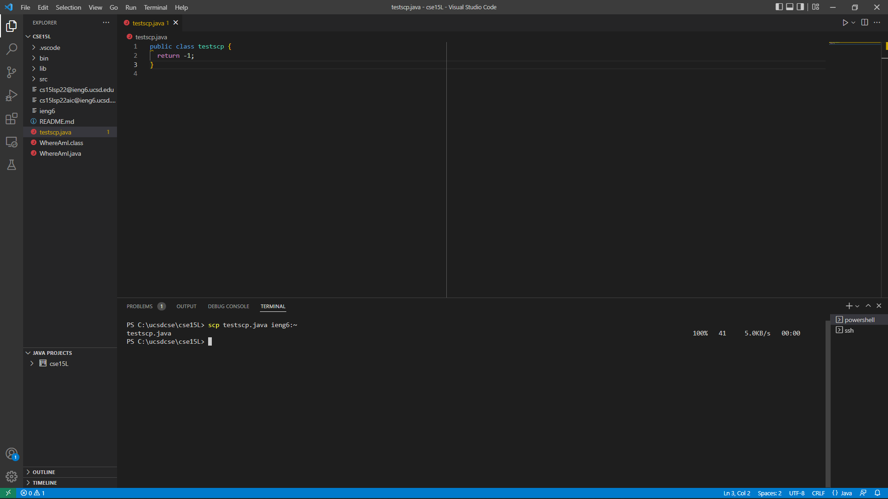
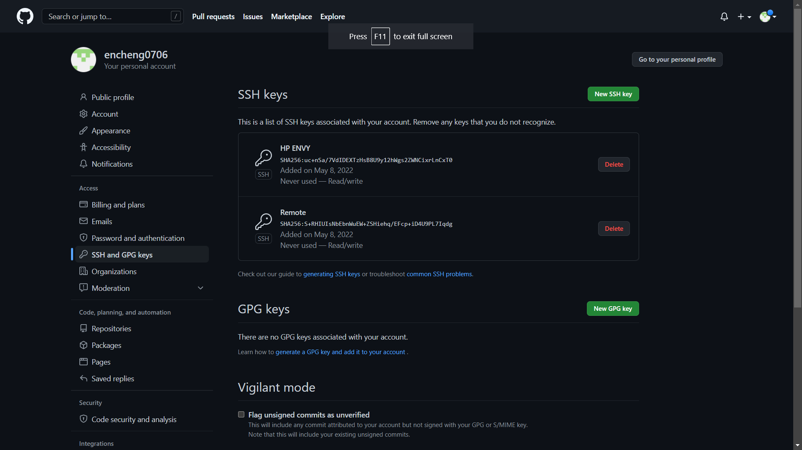
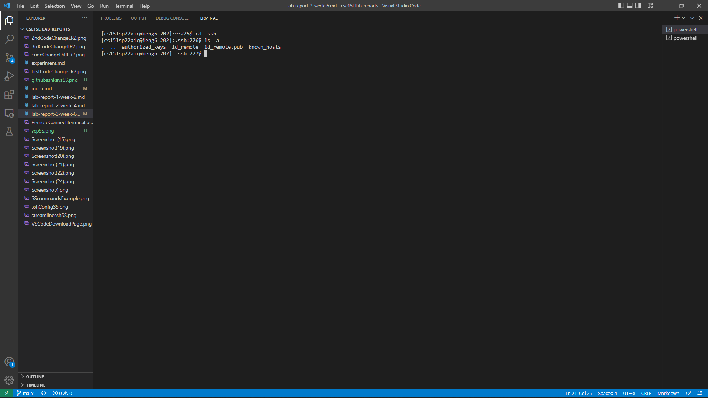
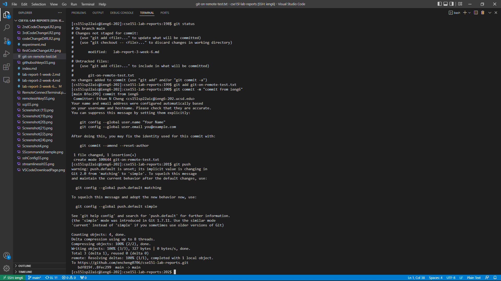
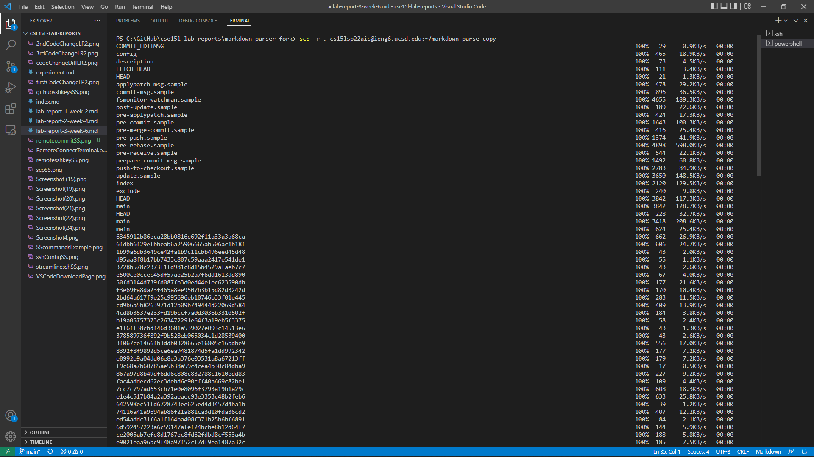
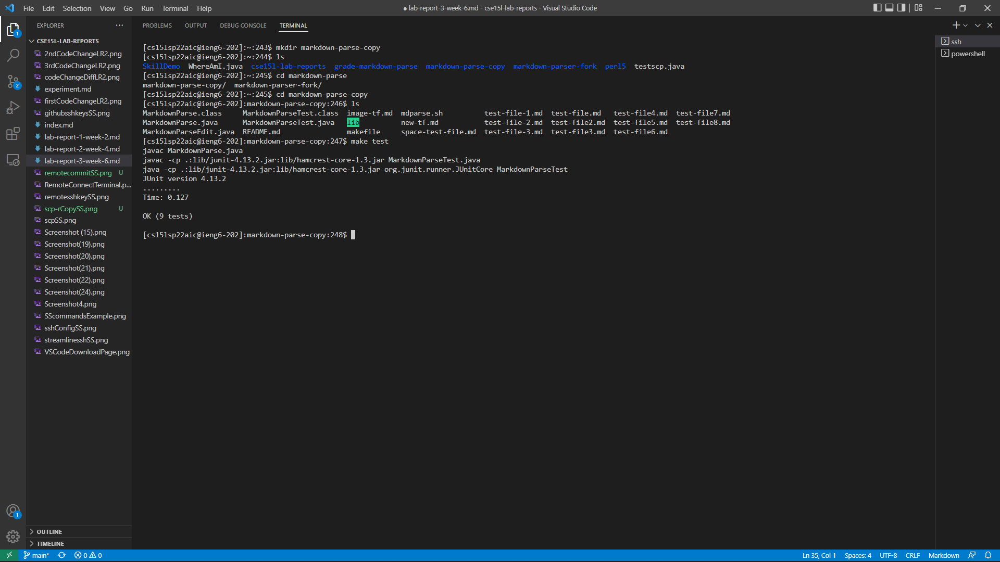
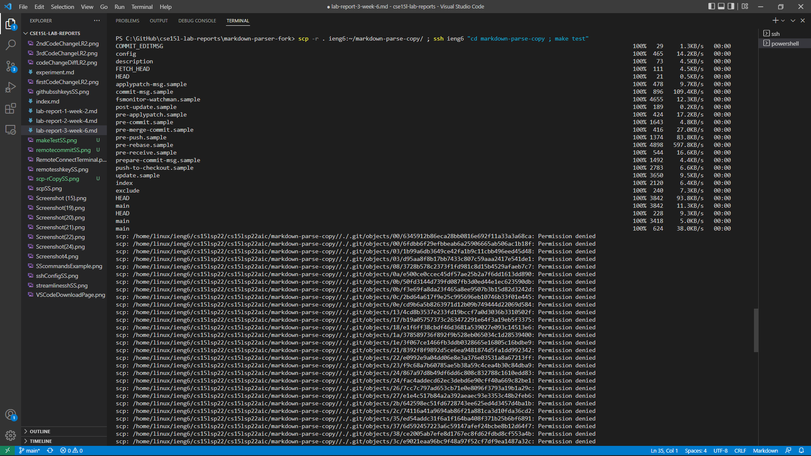
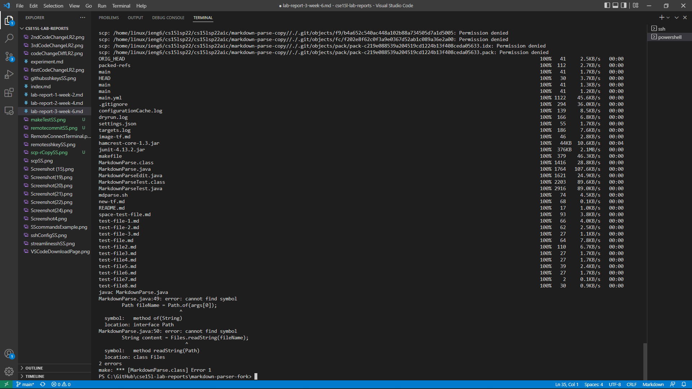

# Lab Report 3

## Streamlining ssh Configuration:
Logging through ssh can be made faster through making an alias for logging into to specific servers. This can be done through opening the ssh config file by using the command `~/.ssh/config` on the local terminal. This will open up the config file where you can create an entry.
<br>

<br> <br>
After saving the changes in the config file, I can now use the alias `ieng6` to log onto the ieng6.ucsd.edu sever quickly:
<br> <br>

<br> <br>
This alias can also be used when using `scp` to copy files over.
<br>

<br>

## Setup GitHub Access from ieng6

ssh keys connected to GitHub:
<br>

<br>

Private and Public keys on remote:<br>

The `id_remote` is private and `id_remote.pub` is public.

git commands can be run on the ieng6 account as well:
<br>

As shown in the screenshot above, I created a file called `git-on-remote-test.txt` and then commited and pushed it all through my ieng6 account. ([commit here](https://github.com/encheng0706/cse15l-lab-reports/commit/8fec299c48d706fb065bca83e374e336b5ee8b8e))

## Copying whole directories with `scp -r`

Using the command 
> scp -r . _AccountName_:~/_TargetedDirectory_

will copy over everything in the current directory to a target directory. The `.` means everything in the current directory.
<br>

<br>
After I moved it over, I was able to run the junit tests remotely on my ieng6 account.<br>

<br>
It is also possible do all of this in one line, by combining all the commands together into 1 single line:
> ```scp -r . ieng6:~/markdown-parse-copy/ ; ssh ieng6 "cd markdown-parse-copy ; make test"```


