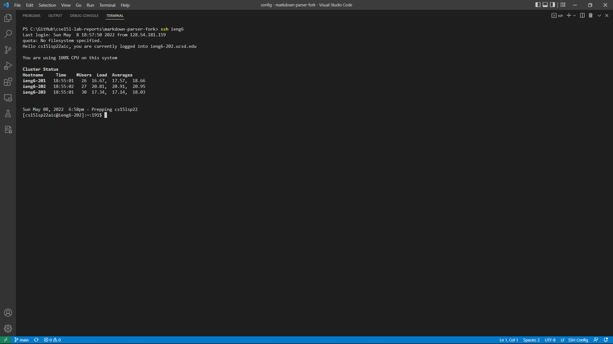

# Lab Report 3

## Streamlining ssh Configuration:
Logging through ssh can be made faster through making an alias for logging into to specific servers. This can be done through opening the ssh config file by using the command `~/.ssh/config` on the local terminal. This will open up the config file where you can create an entry.
 

   
After saving the changes in the config file, I can now use the alias `ieng6` to log onto the ieng6.ucsd.edu sever quickly:
   

