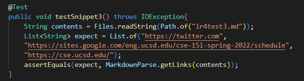

# Lab Report 4

[My Markdown Parse Repo](https://github.com/encheng0706/markdown-parser-fork)<br>
[Week 7 Review Repo](https://github.com/philliptwu/markdown-parser)

## Snippet 1 Test Case
For Snippet 1, the expected output should be ```[`google.com, google.com, ucsd.edu]```.<br>
This was the test I used:


It didn't pass on our own parser:


It didn't pass on the parser we reviewed:


## Snippet 2 Test Case
The expected output for this snippet is ```[a.com, a.com(()), example.com]```.<br>The test I wrote is:


It did not pass on my parser:


It didn't pass on the reviewed parser either:


## Snippet 3 Test Case
The expected output of this snippet is ```["https://twitter.com", "https://sites.google.com/eng.ucsd.edu/cse-15l-spring-2022/schedule", "https://cse.ucsd.edu/"]```
<br>The test for this is:



This test case did not pass for both mine:


and the reviewed:


## Concluding Thoughts and Ideas
### Snippet 1
I think that there would have to be a more involved change for dealing with backticks, since the inline code formatting seems to have different priorities based on where it is located. In the [] part of the link where the clickable text is in, the `(backtick) used for inline code take over the brackets, like in the first example in Snippet 1. But when the backticks are used in the () part of the actual link, the backticks become part of the url link, like in the 2nd example. I think it would be hard to implement a solution for this in less than 10 lines of coding.

### Snippet 2
Similarly to Snippet 1, I think that there would need to be a more involved change for cases relating to parentheses, brackets, and escaped brackets. Based on the first example, with a nested link, the preview shows that the link would actually be the nested one. This is an issue because our parser checks for the last bracket for a link, so it doesn't take the nested link into account.

## Snippet 3
For this test, I think that it might be possible to fix the issue with newlines. Maybe I could add a loop that modifies the string that the md file is turned into, where newlines are cut out. Then by feeding in the edited string, it should be able to work better without the edge cases of the newlines.