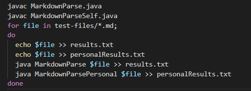
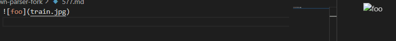
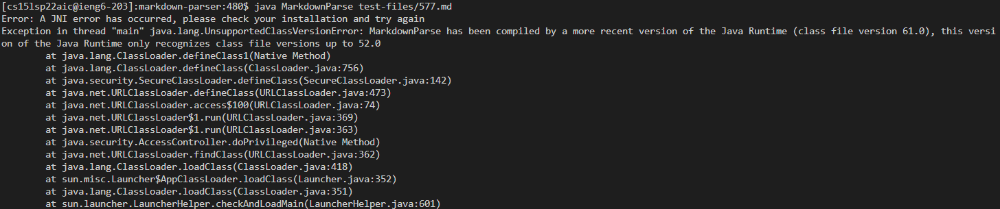
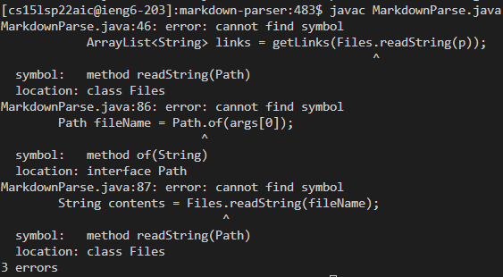
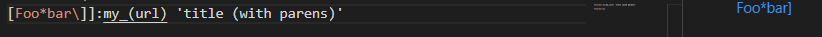

# Lab Report 5

## Finding Tests with Different Results

To find the tests with different results, use `vimdiff` after the bash script file. `vimdiff` compares the two results.txt files to easily tell which tests
have different results.

## Test Case Example 1

There first test case was [Test 577](https://github.com/nidhidhamnani/markdown-parser/blob/main/test-files/577.md). 

The expected output would be: `[]`  

In this test, the incorrect output was from the markdown parser that we cloned.
That parser did not consider the ! part of the formatting for an image, so it 
thought that it was a link.
Our group's implementation worked for this test case. 
 
I was unable to run the outputs due to errors.

## Test Case Example 2

The next test case was [Test 194](https://github.com/nidhidhamnani/markdown-parser/blob/main/test-files/194.md).  

The expected output should be `[]` due to not being a real link.

The incorrect output was in the given parser from the lab. Our own parser got the correct input while the given one had an output of `[url]`. The cloned parser was not able to recognise the `:my_` part that seperated the brackets from the parthentheses, so it incorrectly thought that it was a valid link.

There are no screenshots from my machine of the outputs due to the same errors as in Test Case Example 1.